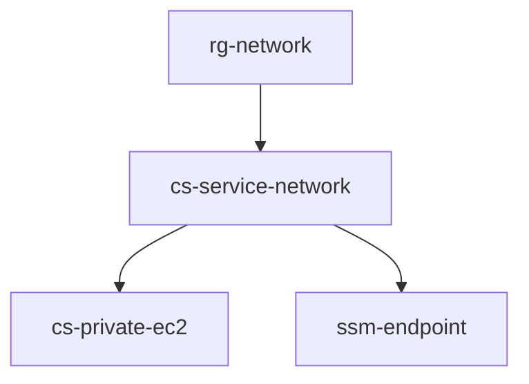

# service-network

AWS 上にサービスネットワーク構成を作成する Terraform コードです。ルートモジュールから 4 つの子モジュールを順に呼び出し、VPC Lattice を使って RDS とプライベート EC2 を接続し、Session Manager 用の VPC エンドポイントも構成します。

## 構成概要

この Terraform では以下を作成します。

- RG-Network 用 VPC
- RDS PostgreSQL 16.6
- VPC Lattice Resource Gateway / Resource Configuration
- CS-ServiceNetwork 用 VPC
- Regional NAT Gateway
- VPC Lattice Service Network と ServiceNetwork タイプの VPC Endpoint
- プライベートサブネット上の EC2 インスタンス
- SSM / SSMMessages / EC2Messages 用 Interface VPC Endpoint

モジュールの依存関係は次の通りです。



## ディレクトリ構成

```text
.
|-- main.tf
|-- providers.tf
|-- variables.tf
|-- outputs.tf
`-- modules
    |-- rg-network
    |-- cs-service-network
    |-- cs-private-ec2
    `-- ssm-endpoint
```

## モジュールの役割

### rg-network

以下を作成します。

- VPC CIDR: `10.0.0.0/16`
- 2 つのプライベートサブネット
- RDS 用 DB Subnet Group
- PostgreSQL RDS
- Resource Gateway 用セキュリティグループ
- VPC Lattice Resource Gateway
- VPC Lattice Resource Configuration

主な出力値:

- VPC ID
- VPC CIDR
- Private Subnet ID
- Private Security Group ID
- Resource Configuration ARN / ID

### cs-service-network

以下を作成します。

- VPC CIDR: `20.0.0.0/16`
- 1 つのプライベートサブネット
- Internet Gateway
- Regional NAT Gateway
- プライベートルートテーブル
- VPC Lattice Service Network
- Resource Configuration との関連付け
- ServiceNetwork タイプの VPC Endpoint

主な出力値:

- VPC ID
- VPC CIDR
- Private Subnet ID
- Private Security Group ID

### cs-private-ec2

以下を作成します。

- プライベートサブネットに接続された ENI
- ENI を利用する EC2 インスタンス
- PostgreSQL クライアントをインストールする User Data

主な出力値:

- EC2 のプライベート IP

### ssm-endpoint

以下を作成します。

- SSM 用 Interface VPC Endpoint
- SSMMessages 用 Interface VPC Endpoint
- EC2Messages 用 Interface VPC Endpoint
- それらに関連付くセキュリティグループ

## 前提条件

適用前に以下を確認してください。

- Terraform がインストール済みであること
- AWS 認証情報が利用可能であること
- 対象リージョンは `ap-northeast-1`
- SSM Parameter Store に `MyKMSKeyID` が存在すること
- EC2 インスタンスプロファイル `EC2Instance_Role` が事前作成済みであること

補足:

- RDS のマスターパスワードは `manage_master_user_password = true` で Secrets Manager 管理です
- EC2 の AMI は `ami-0b2cd2a95639e0e5b` に固定されています。リージョン変更時は見直しが必要です

## 使用方法

初期化:

```bash
terraform init
```

実行計画の確認:

```bash
terraform plan
```

適用:

```bash
terraform apply
```

削除:

```bash
terraform destroy
```

## ルートモジュール出力

ルートモジュールでは以下の出力を公開しています。

| Output | 説明 |
|---|---|
| `rg_network_vpc_id` | RG-Network 側 VPC ID |
| `rg_network_resource_config_arn` | Resource Configuration ARN |
| `rg_network_resource_config_id` | Resource Configuration ID |
| `cs_service_network_vpc_id` | CS-ServiceNetwork 側 VPC ID |
| `cs_service_network_private_subnet_02_id` | CS-ServiceNetwork 側プライベートサブネット ID |
| `cs_private_ec2_private_ip` | EC2 のプライベート IP |

## 注意点

- Regional NAT Gateway を作成するため、検証用途でもコストが発生します
- RDS は `skip_final_snapshot = true` のため、`terraform destroy` 時に最終スナップショットを取得しません
- セキュリティグループやポリシーは検証向けのため、本番利用時は最小権限に見直してください
- SSM VPC Endpoint のポリシーは広く許可しているため、必要に応じて制限してください

## 使用プロバイダ

- hashicorp/aws `6.41.0`
